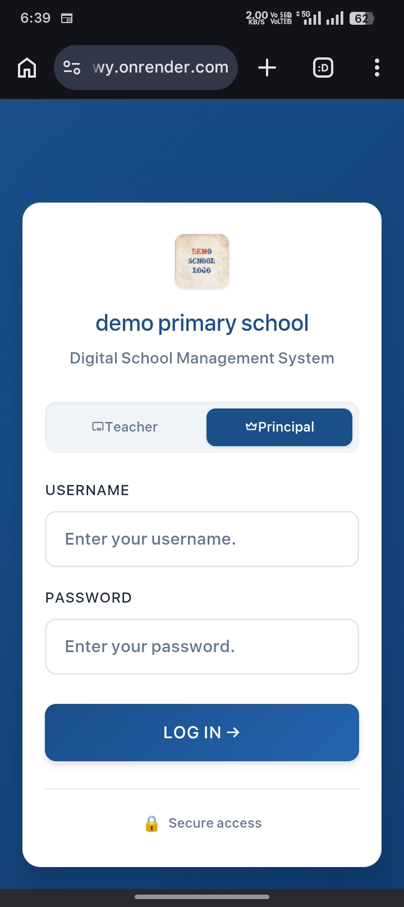
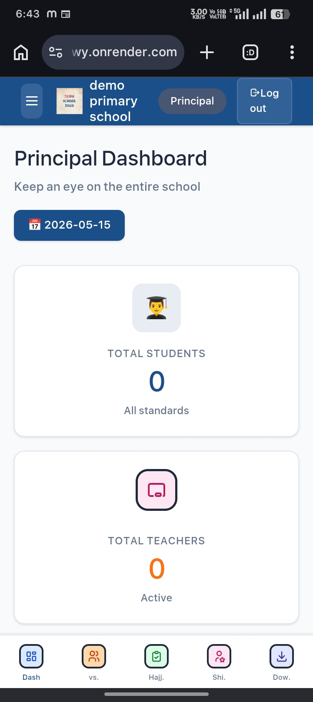
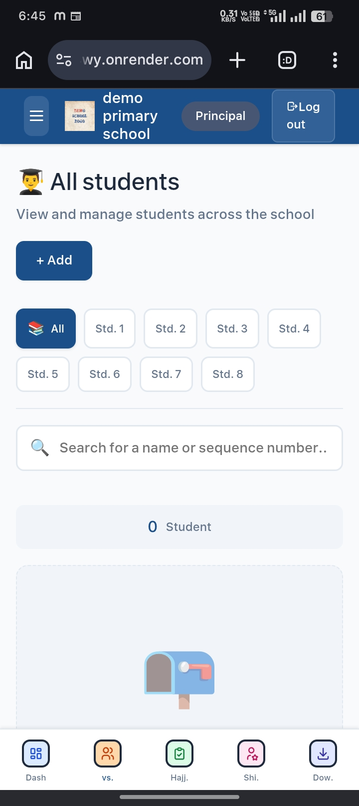
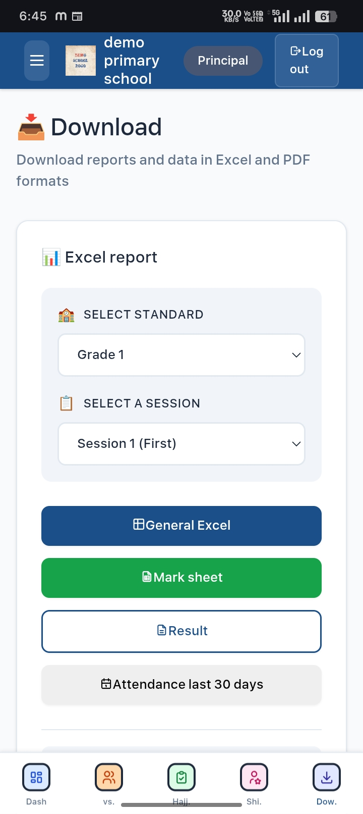
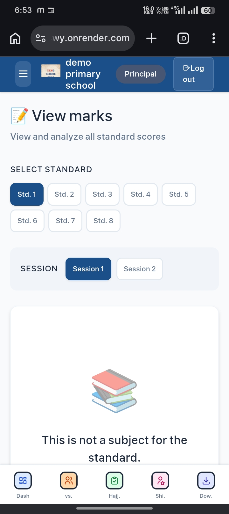

# School Management System

A Flask-based School Management System built for backend practice, rapid prototyping, and hands-on full-stack learning.

The project includes authentication, student management, attendance tracking, marks management, Excel export, PDF report generation, and Supabase database integration.

---

## Live Demo

https://school-management-system-a4wy.onrender.com/

---

## Demo Credentials

| Role | Username | Password |
|---|---|---|
| Demo Admin | demo_principle | demo_principle |

---

## Note

This is a public demo environment created for project showcase purposes.

Some features may be restricted in demo mode, and demo data may reset periodically.

---

## Features

- Admin authentication system
- Student management
- Attendance tracking
- Marks management
- Dashboard interface
- Excel export functionality
- PDF report generation
- Supabase database integration
- Responsive frontend using HTML, CSS, and JavaScript

---

## Tech Stack

### Backend

- Flask
- Python

### Database

- Supabase

### Frontend

- HTML
- CSS
- JavaScript

### Libraries

- OpenPyXL
- ReportLab
- Gunicorn

---

## Development Approach

This project was built as a fast-moving learning project using a combination of AI-assisted development, self-learning, debugging, experimentation, and manual implementation.

The primary focus was understanding how real backend systems work — including authentication flows, database integration, report generation, deployment, and overall application structure — while rapidly iterating on features and improving through hands-on practice.

---

## Project Structure

```bash
school-management-system/
│
├── static/
├── templates/
├── app.py
├── requirements.txt
├── Procfile
├── .env.example
└── README.md
```

---

## Installation

### Clone Repository

```bash
git clone https://github.com/YOUR_USERNAME/school-management-system.git

cd school-management-system
```

---

### Create Virtual Environment

```bash
python -m venv venv
```

Activate the virtual environment:

#### Windows

```bash
venv\Scripts\activate
```

#### Linux / Mac

```bash
source venv/bin/activate
```

---

### Install Dependencies

```bash
pip install -r requirements.txt
```

---

## Environment Variables

Create a `.env` file in the root directory and add the following:

```env
SUPABASE_URL=your_supabase_url
SUPABASE_KEY=your_supabase_key
SECRET_KEY=your_secret_key
```

---

## Run Locally

```bash
python app.py
```

---

## Deployment

This project can be deployed easily on platforms like:

- Render
- Railway

Recommended platform:

https://render.com

---

## Screenshots

Add project screenshots here.

Suggested screenshots:

### 🔐 Login Page


---

### 📊 Dashboard


---

### 👨‍🎓 Students Page


---

### 📝 Report Generation


---

### 📈 Marks Management


---

## Future Improvements

- Flask Blueprints architecture
- Better project structure
- Role-based access control
- REST API integration
- Improved UI/UX
- Better validation and security
- Better database abstraction
- Audit logging and activity tracking

---

## Demo Reset Instructions

If the public demo password gets changed, run the following SQL query inside the Supabase SQL Editor to restore the demo account password.

```sql
UPDATE public.users
SET password_hash = 'scrypt:32768:8:1$OC1cq5Zq6inGBP5S$18d52fdfd74c9066f8b146099224eb787ec836b3e60d5bdefda5904c7b614385f59a556cccb3373da98ab433727df264a87da18f84ae488685ca9dce45303d70'
WHERE username = 'demo_principal';
```

### Reset Steps

1. Open Supabase Dashboard
2. Go to SQL Editor
3. Create a New Query
4. Paste the SQL query above
5. Run the query

---

## Disclaimer

This project was mainly built for educational purposes, backend practice, rapid prototyping, and understanding full-stack application workflows.

---

## License

This project is open-source and available under the MIT License.
